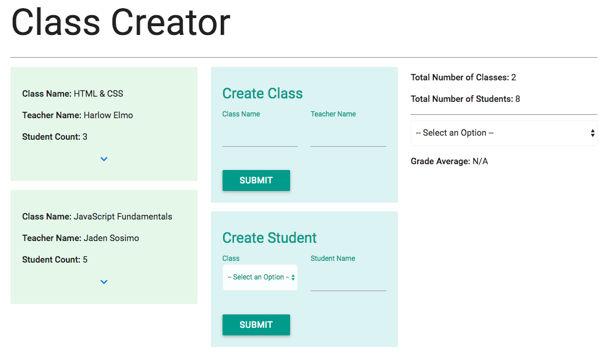

# Course Creator
> An easy to use application that allows you to plan a school's classes with multiple students

Course Creator is an AngularJS application built to make it easier to plan courses. Users can:

* Create courses
* Assign students to those courses
* Assign grades to individual students and see overall statistics
* Download course information as a CSV

> [Demo Here](http://wesreid-course-creator.surge.sh/)

## Installation

Clone this repository and then simply open `index.html` with your favorite browser!

## Next Steps

- [ ] Allow for importing of courses and students via CSV
- [ ] Add more statistics and information including comparisons and graphing
- [ ] Make it visually easier to work with many courses and classes
